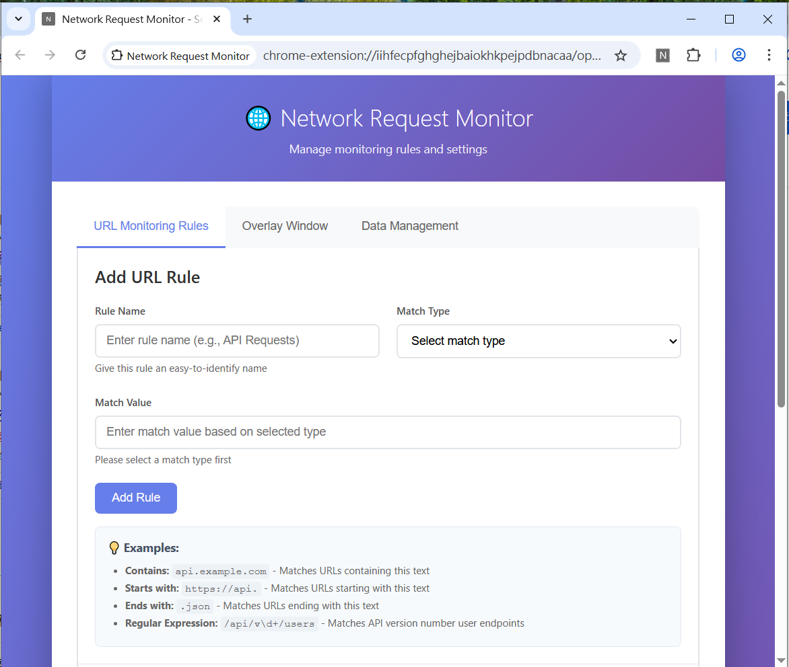
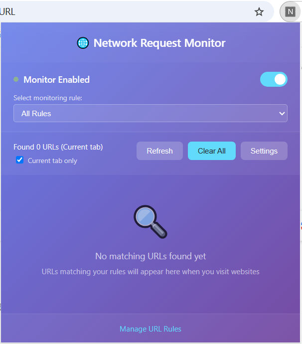
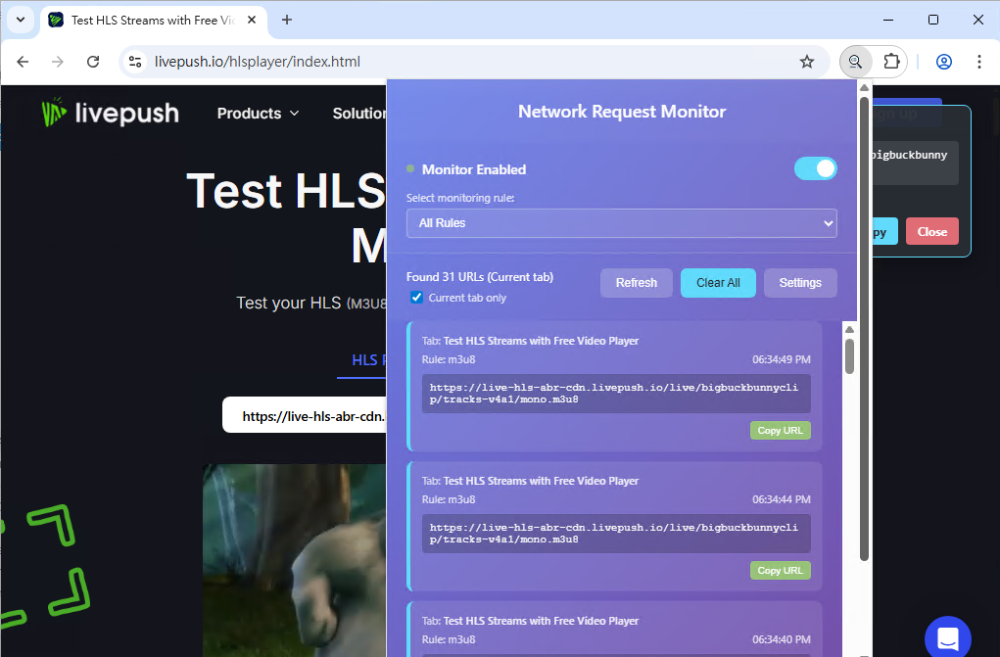

# 🌐 Chrome Network Request Monitor Extension

A powerful Chrome extension that monitors network requests on web pages and finds specific URLs based on custom rules.

[繁體中文說明](README_zh-TW.md)

[Available in the Chrome Web Store](https://chromewebstore.google.com/detail/network-request-monitor/ndjddfkhomfpilckgiejcknepjkpllbh)

## ✨ Features

- 🔍 **Real-time Monitoring**: Automatically monitors all network requests on active tabs
- 📋 **Custom Rules**: Supports multiple matching patterns (contains, starts with, ends with, regex)
- 📌 **Page Overlay Display**: Shows notification boxes on pages for the rules you are currently showing
- 👁️ **Rule Selection**: Choose which rules appear in the popup list and as page overlays; every match is still recorded either way
- 🎯 **Tab Filtering**: Option to display URLs from all tabs or current tab only
- 📊 **Unified Management**: View all found URLs in the popup window
- ⚙️ **Flexible Settings**: Easily manage matching rules through the options page
- 📋 **One-click Copy**: Quickly copy found URLs

## 💻 Screenshots

### Custom Rules

### Real-time Monitoring

### List of Found URLs

## 🚀 Installation

### From Chrome Web Store (Recommended)
Install directly from the Chrome Web Store: [Network Request Monitor](https://chromewebstore.google.com/detail/network-request-monitor/ndjddfkhomfpilckgiejcknepjkpllbh)

1. Visit the Chrome Web Store link above
2. Click "Add to Chrome" button
3. Confirm the installation when prompted

### From Source
1. Download or clone this repository
2. Open your browser's extension management page:
   - Chrome: Go to `chrome://extensions/`
   - Edge: Go to `edge://extensions/`
3. Enable "Developer mode"
4. Click "Load unpacked" and select the extension folder

## 📖 Usage Guide

### Step 1: Set Matching Rules

1. Click the extension icon in Chrome toolbar
2. Click the "Settings" button or right-click and select "Options"
3. Add URL matching rules on the options page:
   - **Rule Name**: Give the rule an easily identifiable name
   - **Match Type**: Select matching pattern
   - **Match Value**: Enter the content to match

### Step 2: Start Monitoring

After setting up rules, when you browse websites:
- URLs matching the rules are recorded, and notification boxes appear in the top right corner of the page for the rules you are showing (every rule, by default)
- Click the "Copy" button in the notification box to copy the URL
- Click the "Close" button to dismiss the notification box

### Step 3: View History

- Click the extension icon to open the popup window
- Use the "Show rules" list to pick which rules you want to see. This controls both the list below it and the overlays on the page; unticked rules are still recorded and reappear when you tick them again
- A URL can match several rules at once. It is shown as long as any one of those rules is ticked, and the entry names all of them
- By default, only URLs from the current tab are displayed. Uncheck "Show current tab only" to view URLs from all tabs
- The list keeps up with what is being captured on its own. Untick "Update automatically" to hold it still while you read; anything captured meanwhile is still recorded, and ticking it again or pressing "Refresh" brings it in
- View the list of found URLs
- Click the "Copy URL" button to copy specific URLs
- Use the "Clear All" button to clear the history

## 🔧 Matching Rule Types

| Type | Description | Example |
|------|-------------|---------|
| **Contains** | URL contains specified text | `api.example.com` |
| **Starts With** | URL starts with specified text | `https://api.` |
| **Ends With** | URL ends with specified text | `.json` |
| **Regex** | Match using regular expressions | `/api/v\d+/users` |

## 💡 Usage Examples

### Example 1: Monitor API Requests
- **Rule Name**: `API Requests`
- **Match Type**: `Contains`
- **Match Value**: `/api/`

### Example 2: Monitor JSON Data
- **Rule Name**: `JSON Data`
- **Match Type**: `Ends With`
- **Match Value**: `.json`

### Example 3: Monitor Specific API Versions
- **Rule Name**: `API Version Monitor`
- **Match Type**: `Regex`
- **Match Value**: `/api/v[0-9]+/`

## 🛠️ Technical Specifications

- **Manifest Version**: V3
- **Supported Browsers**: Chrome 88+
- **Required Permissions**:
  - `activeTab`: Access active tabs
  - `tabs`: Read tab titles, and send notification boxes to open tabs
  - `storage`: Store user settings
  - `webRequest`: Monitor network requests

## Why site access (`<all_urls>`) is required

- Real-time monitoring across sites: The extension observes request URLs on pages you visit and matches them against your custom rules. Because target sites cannot be listed in advance, access to all sites is required for reliable operation.
- Background listener scope: The background service uses `chrome.webRequest.onBeforeRequest` with a URL filter of `<all_urls>` and reads only what is necessary for matching: request URL, timestamp, and tab identification. It does not block or modify traffic and does not read request or response bodies.
- Content script overlay: The content script runs on pages matching `<all_urls>` only to render a small, temporary on-page overlay when a match is found. It renders UI to help you copy the URL and does not read or alter page content.
- Data minimization and control: All processing is local. Rules/settings are stored in Chrome Sync; the set of rules you are currently showing stays on this device and is never synced; found URLs are kept only for the current session and can be cleared anytime. Monitoring can be toggled, and results can be limited to the current tab.

## 🔒 Privacy Notice

- This extension only processes data locally and does not upload any information to external servers
- User-defined rules are stored in Chrome sync storage
- The set of rules you are currently showing is stored in local storage on this device only, so it does not follow you to another computer
- Found URLs are only temporarily stored in memory and are not permanently saved

## 🤝 Contributing

Issue reports and feature suggestions are welcome!

## 📄 License

This project is licensed under the GPL-3.0 License.

---

**Enjoy using the Network Request Monitor!** 🎉 
