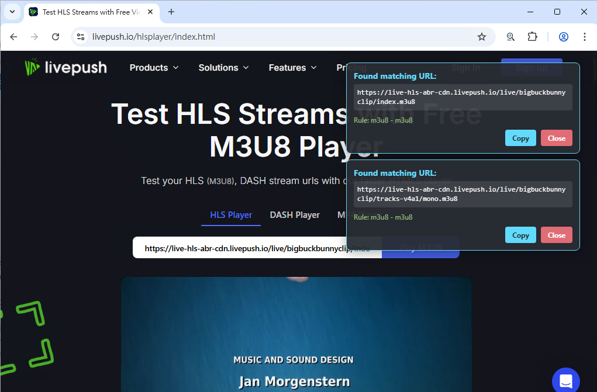
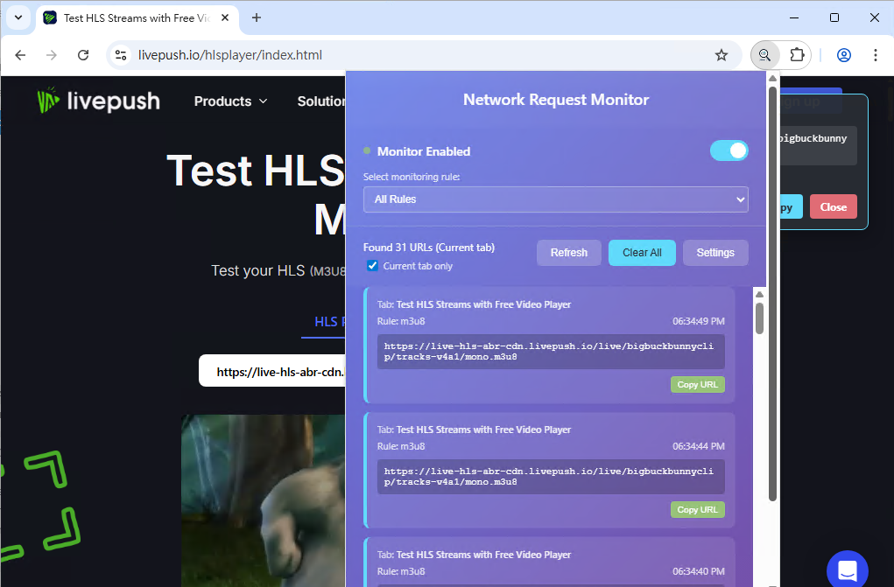

# 🌐 網絡請求監控器 Chrome 擴展

一個強大的Chrome擴展程式，可以監控網頁的網絡請求並根據自定義規則查找特定的URL。

[English Documentation](README.md)

## ✨ 功能特色

- 🔍 **實時監控**：自動監控活動標籤頁的所有網絡請求
- 📋 **自定義規則**：支援多種匹配模式（包含、開頭匹配、結尾匹配、正則表達式）
- 📌 **頁面覆蓋顯示**：找到匹配的URL時會在頁面上顯示通知框
- 🎯 **分頁過濾**：可選擇顯示所有分頁或僅目前分頁的URL
- 📊 **統一管理**：在彈出窗口中查看所有找到的URL
- ⚙️ **靈活設定**：通過選項頁面輕鬆管理匹配規則
- 📋 **一鍵複製**：快速複製找到的URL

## 💻 畫面截圖

### 可客製化的規則


### 即時監控


### 找到網址的列表


## 🚀 安裝方法

### 1. 開發者模式安裝（推薦）

1. 打開Chrome瀏覽器
2. 訪問 `chrome://extensions/`
3. 開啟右上角的「開發者模式」
4. 點擊「載入未封裝項目」
5. 選擇包含擴展文件的資料夾
6. 擴展安裝完成！

### 2. 文件結構

```
chrome_request_monitor/
├── manifest.json          # 擴展配置文件
├── background.js          # 後台服務腳本
├── content.js            # 內容腳本
├── popup.html            # 彈出窗口頁面
├── popup.js              # 彈出窗口腳本
├── options.html          # 選項頁面
├── options.js            # 選項頁面腳本
├── styles.css            # 樣式文件
├── README.md             # 說明文件 (英文)
└── README_zh-TW.md       # 說明文件 (繁體中文)
```

## 📖 使用指南

### 第一步：設定匹配規則

1. 點擊Chrome工具欄中的擴展圖標
2. 點擊「設定」按鈕或右鍵選擇「選項」
3. 在選項頁面中新增URL匹配規則：
   - **規則名稱**：給規則一個容易識別的名稱
   - **匹配類型**：選擇匹配模式
   - **匹配值**：輸入要匹配的內容

### 第二步：開始監控

設定完規則後，當您瀏覽網站時：
- 符合規則的URL會自動在頁面右上角顯示通知框
- 點擊通知框中的「複製」按鈕可複製URL
- 點擊「關閉」按鈕可關閉通知框

### 第三步：查看歷史記錄

- 點擊擴展圖標打開彈出窗口
- 預設只顯示目前分頁的URL，取消勾選「只顯示目前分頁」可查看所有分頁的URL
- 查看找到的URL列表
- 點擊「複製URL」按鈕複製特定URL
- 使用「清除全部」按鈕清空歷史記錄

## 🔧 匹配規則類型

| 類型 | 說明 | 範例 |
|------|------|------|
| **包含** | URL中包含指定文字 | `api.example.com` |
| **開頭匹配** | URL以指定文字開頭 | `https://api.` |
| **結尾匹配** | URL以指定文字結尾 | `.json` |
| **正則表達式** | 使用正則表達式匹配 | `/api/v\d+/users` |

## 💡 使用範例

### 範例1：監控API請求
- **規則名稱**：`API請求`
- **匹配類型**：`包含`
- **匹配值**：`/api/`

### 範例2：監控JSON數據
- **規則名稱**：`JSON數據`
- **匹配類型**：`結尾匹配`
- **匹配值**：`.json`

### 範例3：監控特定版本的API
- **規則名稱**：`API版本監控`
- **匹配類型**：`正則表達式`
- **匹配值**：`/api/v[0-9]+/`

## 🛠️ 技術規格

- **Manifest版本**：V3
- **支援瀏覽器**：Chrome 88+
- **權限要求**：
  - `activeTab`：訪問活動標籤頁
  - `storage`：存儲用戶設定
  - `webRequest`：監控網絡請求
  - `scripting`：注入內容腳本

## 為何需要網站存取權限（`<all_urls>`）

- 跨站即時監控：擴充功能需觀察您瀏覽之頁面所發出的請求 URL，並與自訂規則比對。由於可能目標站台無法事先列出，為確保在各網站皆能正常運作，需要 `<all_urls>` 範圍。
- 背景監聽範圍：背景服務以 `<all_urls>` 作為 `chrome.webRequest.onBeforeRequest` 的篩選條件，只讀取比對所需的最低限度資訊：請求 URL、時間戳、來源分頁識別。不阻擋或修改流量，也不讀取請求/回應主體。
- 內容腳本覆層：內容腳本會在符合 `<all_urls>` 的頁面執行，以便於命中時顯示短暫的小浮層。僅渲染 UI 以協助複製 URL，不讀取或更動頁面內容。
- 資料最小化與控制：所有處理皆在本機完成。規則/設定儲存於 Chrome 同步儲存；找到的 URL 僅在工作階段暫存，且可隨時清除。您可切換監控，並選擇僅顯示目前分頁結果。

## 🔒 隱私說明

- 此擴展僅在本地處理數據，不會上傳任何信息到外部伺服器
- 用戶設定的規則存儲在Chrome同步存儲中
- 找到的URL僅暫時存儲在內存中，不會永久保存

## 🤝 貢獻

歡迎提交問題報告和功能建議！

## 📄 許可證

此專案使用GPL-3.0許可證。

---

**享受使用網絡請求監控器！** 🎉 